# ArchMind AI — Architecture

## System overview

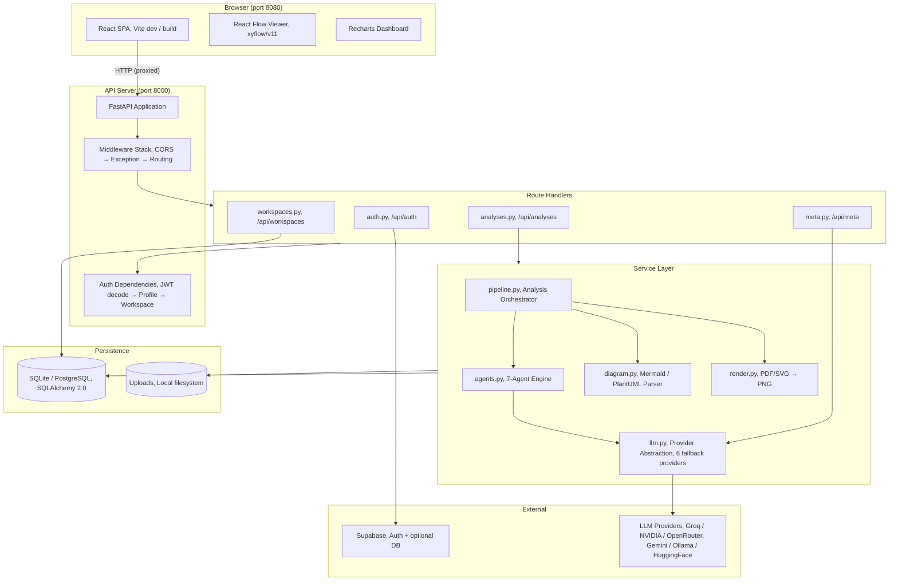

## Frontend architecture

```mermaid
flowchart TB
  subgraph Entry
    main["main.tsx, ReactDOM.createRoot"]
    App["App.tsx, BrowserRouter + Providers"]
  end

  subgraph Providers["Context Providers"]
    QP["QueryClientProvider, TanStack Query"]
    AP["AuthProvider, AuthContext"]
    TP["ThemeProvider"]
  end

  subgraph Layout["Layout"]
    AL["AppLayout.tsx, Sidebar + Header + Main"]
    PR["ProtectedRoute.tsx, Auth guard → /login"]
  end

  subgraph Pages["Pages"]
    LANDING["Landing.tsx, Marketing page"]
    LOGIN["Login.tsx → AuthShell"]
    SIGNUP["Signup.tsx → AuthShell"]
    DASH["Dashboard.tsx, Stats + Recent + Chart"]
    UPLOAD["Upload.tsx, File / Paste / URL"]
    ANAL["Analyses.tsx, List table with scores"]
    DETAIL["AnalysisDetail.tsx, Flow viewer + Findings + Chat"]
    REPORT["AgentReport.tsx, Per-agent deep dive"]
    COMPARE["Compare.tsx, Side-by-side delta"]
    WS["Workspaces.tsx, Team management"]
    SETT["Settings.tsx, Profile / Notifications / Integrations"]
    BILL["Billing.tsx, Plan + usage"]
  end

  subgraph Shared["Shared"]
    UI["ui/, 30+ Shadcn components"]
    HOOKS["hooks/, use-mobile, use-toast"]
    LIBS["lib/, api.ts, supabase.ts, types.ts"]
    CTX["contexts/AuthContext.tsx"]
  end

  main --> App
  App --> QP
  QP --> AP
  AP --> TP
  TP --> Layout
  Layout --> Pages
  Pages --> Shared
```

## Route structure

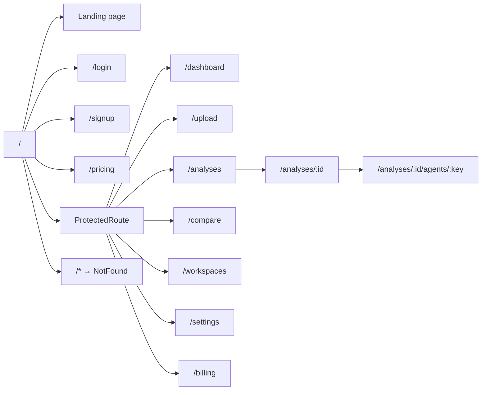

## Backend architecture

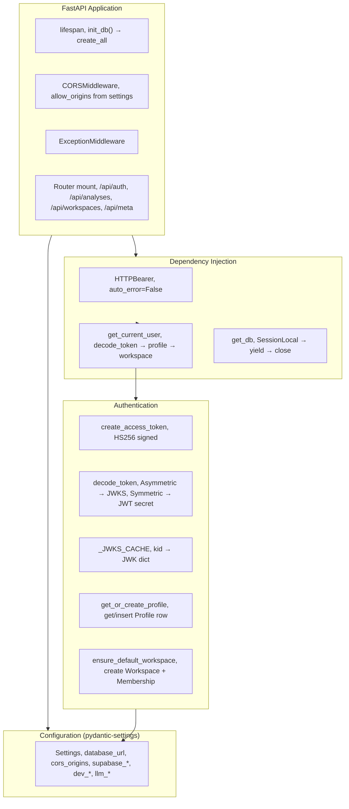

## Database schema

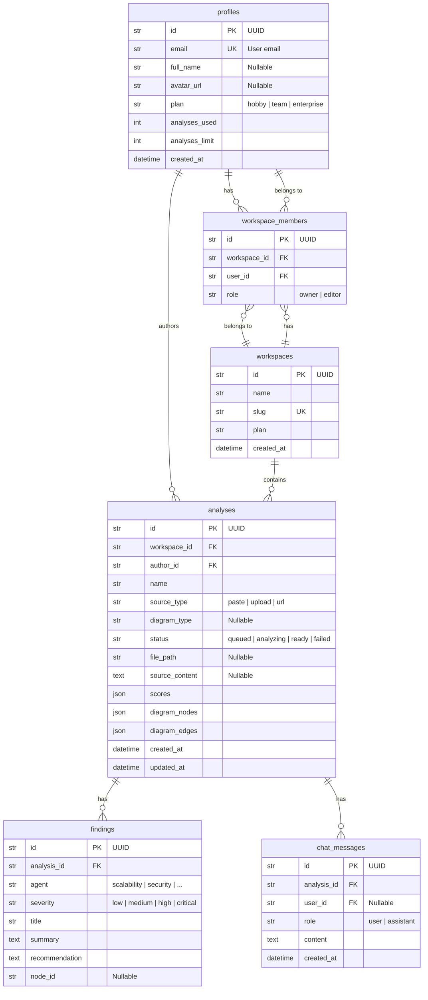

## Auth flow

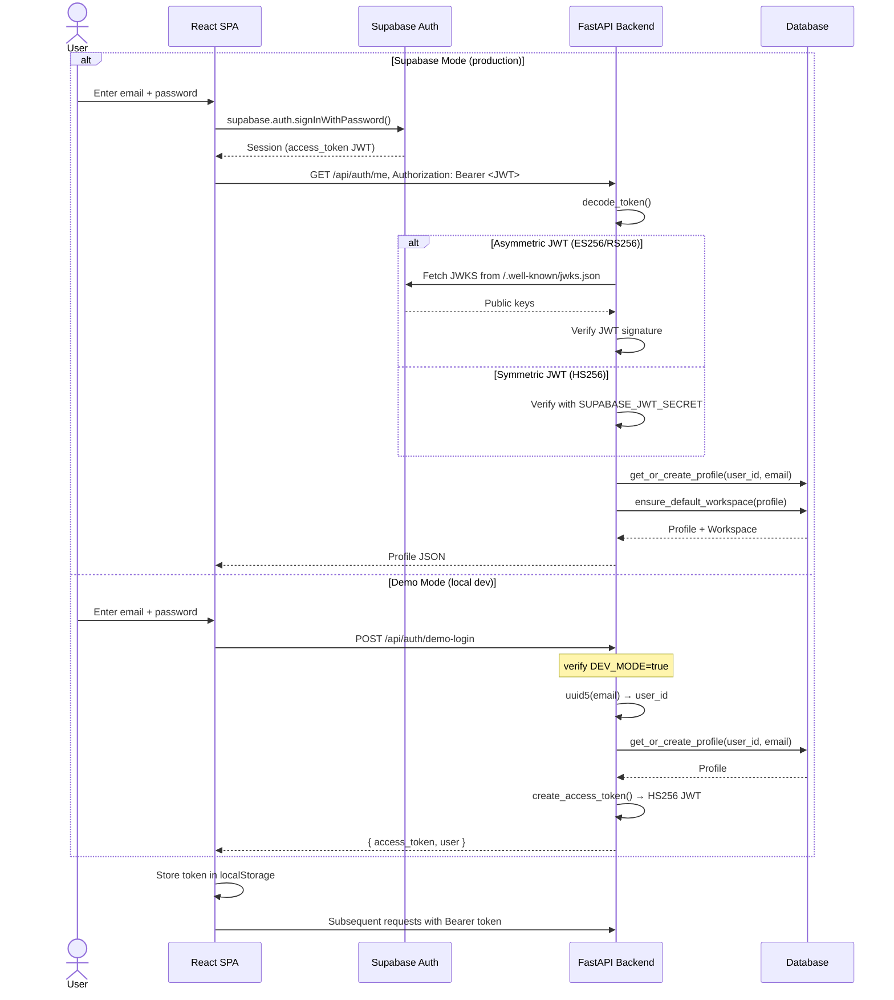

## Analysis pipeline

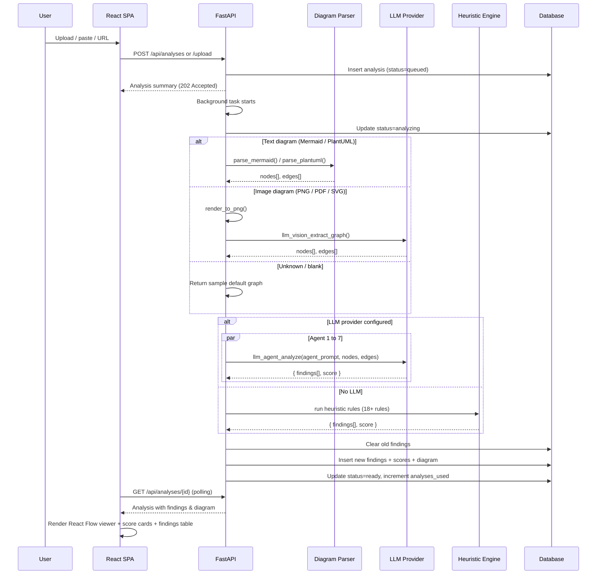

## LLM provider chain

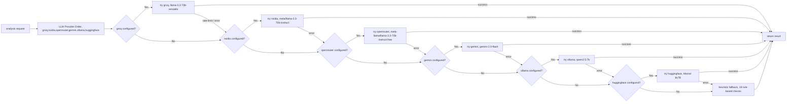

## 7-agent analysis dimensions

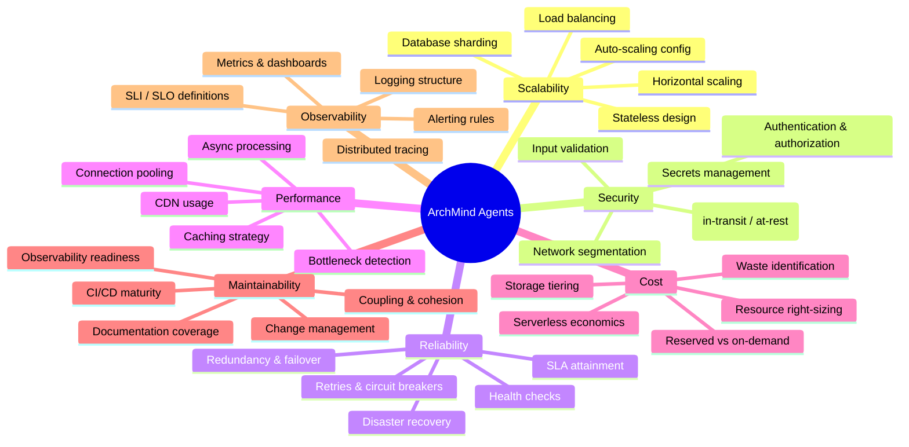

## Data flow: upload to report

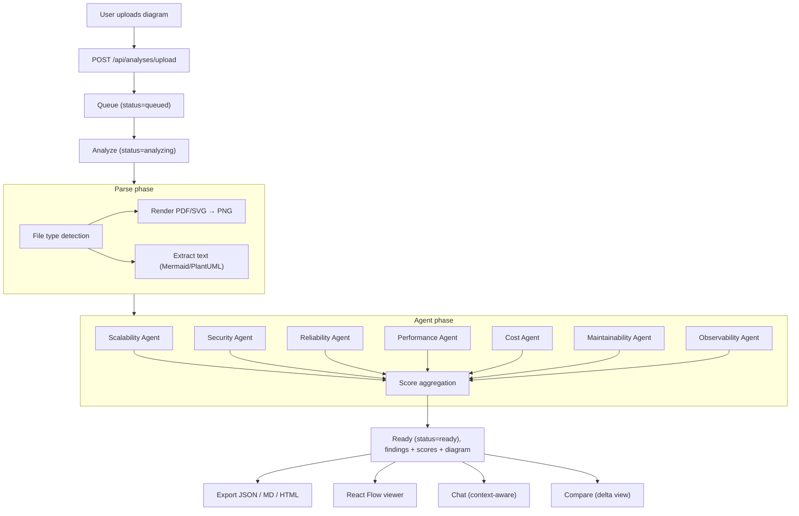

## Deployment architecture

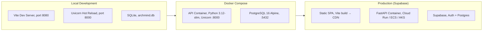

## Key design decisions

| Decision | Rationale |
|----------|-----------|
| **7 independent agents** over a single monolithic prompt | Each agent specializes; failures are isolated; scores are independently computed |
| **Provider fallback chain** over hard dependency on one LLM | No single point of failure; free tiers can be rate-limited; users choose their comfort level |
| **Heuristic fallback** over requiring an LLM | Zero-config onboarding; works in air-gapped environments; provides baseline value immediately |
| **Stateless JWT** over sessions | Simple to implement; no server-side session store; works with horizontal scaling |
| **BackgroundTasks** over a separate worker queue | Minimal infrastructure for MVP; avoids Redis/RabbitMQ dependency; trade-off is no retry on crash |
| **SQLAlchemy** with SQLite + PostgreSQL support | Devs use SQLite locally (zero setup); production uses PostgreSQL (Supabase managed) |
| **Regex-based diagram parser** over full grammar parser | Good enough for 90% of user diagrams; avoids ANTLR/Tree-sitter dependency; fast to execute |
| **Vite proxy** over separate API domain in dev | Eliminates CORS issues in development without proxy config; one URL for the whole app |
