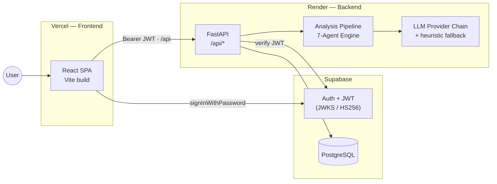

<div align="center">

# ArchMind AI

# Architecture Intelligence Platform — an AI Staff Architect for modern engineering teams

Upload a diagram or paste code, and a team of specialized AI agents scores your architecture, surfaces risks, proposes redesigns, and simulates failures — end to end.

[](https://archmind-ai-topaz.vercel.app)

[](#tech-stack)
[](#tech-stack)
[](#tech-stack)
[](.github/workflows/ci.yml)

**[Live Demo »](https://archmind-ai-topaz.vercel.app)**

<br />


</div>

---

## Overview

ArchMind AI turns architecture review — normally a slow, senior-engineer-only task — into an automated pipeline. Submit an architecture as a Mermaid/PlantUML diagram, an uploaded image/PDF, or a URL, and the platform parses it into a graph, runs **seven specialized analysis agents** across it, and returns a scored report with prioritized, actionable findings.

It goes beyond review into the full architecture lifecycle: generating new designs from a plain-English prompt, simulating traffic load and component failures, proposing one-click redesigns, auditing infrastructure-as-code, and answering context-aware questions about your system.

> Try it live — no signup required for the demo: **<https://archmind-ai-topaz.vercel.app>**

---

## Key Features

- **7-Agent Analysis Engine** — Scalability, Security, Reliability, Performance, Cost, Maintainability, and Observability agents each score a dimension and emit severity-ranked findings, aggregated into an overall architecture score.
- **AI Architecture Generator** — Describe a system in natural language (*"Design an e-commerce platform for 10M users"*) and get back a Mermaid diagram, tech-stack rationale, and starter Kubernetes/Terraform manifests.
- **Simulation & Resilience Suite** — Project latency (p50/p95/p99) and cost across user tiers, and run a chaos failure simulator that traces cascade failures and estimates recovery MTTR.
- **One-Click Redesigns** — Re-optimize a design against blueprints such as Cost Optimized, High Availability, Enterprise Scale, and Multi-Region, with side-by-side comparison.
- **Compliance Auditing** — Score readiness against SOC 2, ISO 27001, GDPR, HIPAA, and PCI DSS and list outstanding gaps.
- **Architecture Copilot** — Chat with an assistant that knows your components, connections, and findings (*"What happens if Redis fails?"*, *"Can I remove Kafka?"*).
- **DevOps, IaC & API Auditing** — Scan Terraform, Kubernetes YAML, and Docker Compose for misconfigurations; review OpenAPI specs; and detect missing database indexes.
- **Docs & Reports** — Auto-generate documentation and executive reports, with export to JSON / Markdown / HTML.
- **Team Workspaces** — Multi-user workspaces with roles, plus CI/CD webhooks to run audits on pull requests.

### Resilient LLM strategy

Analysis runs through a **provider fallback chain** (Groq → NVIDIA → OpenRouter → Gemini → Ollama → HuggingFace). If no provider is configured or all are rate-limited, an **18-rule heuristic engine** produces a baseline score — so the product works with zero LLM keys and never has a single point of failure.

---

## Tech Stack

| Layer | Technologies |
|-------|--------------|
| **Frontend** | Vite, React 18, TypeScript, Tailwind CSS, shadcn/ui (Radix), React Router, TanStack Query, React Flow, Recharts, Framer Motion |
| **Backend** | Python 3.12, FastAPI, SQLAlchemy 2.0, Alembic, Pydantic Settings |
| **Auth** | Supabase (JWT bearer; asymmetric JWKS or symmetric HS256 verification) |
| **Database** | SQLite (local) / PostgreSQL (production, via Supabase) |
| **Testing** | Vitest + Testing Library (frontend), pytest + coverage (backend) |
| **CI / Deploy** | GitHub Actions, Vercel (frontend), Render (backend) |

---

## Architecture

The frontend is a static SPA on Vercel that talks to a FastAPI service on Render; Supabase handles authentication and issues the JWTs the backend verifies.



The backend orchestrates parsing (Mermaid/PlantUML text or image/PDF vision extraction), runs the seven agents in parallel, aggregates scores, and persists findings — all behind stateless JWT auth. For deeper diagrams (auth flow, analysis pipeline, database schema, deployment topology), see **[ARCHITECTURE.md](ARCHITECTURE.md)**.

> **Engineering note:** Render's free tier spins the backend down after ~15 min idle, causing a ~40s cold start. A scheduled [keep-warm workflow](.github/workflows/keep-warm.yml) pings `/api/health` every 10 minutes, and the app warms the backend on load, so users rarely hit the cold path.

---

## Local Development

### Prerequisites

- Node.js 18+
- Python 3.12+

### Backend (FastAPI on `:8000`)

```bash
cd backend
python -m venv .venv
source .venv/bin/activate        # Windows: .venv\Scripts\activate
pip install -r requirements.txt
cp .env.example .env             # defaults work out of the box (SQLite + dev auth)
python run.py                    # serves http://localhost:8000  (health: /api/health)
```

The backend runs with no LLM keys — it falls back to the heuristic engine. Add provider keys to `.env` to enable AI analysis.

### Frontend (Vite on `:8080`)

```bash
npm install
npm run dev                      # http://localhost:8080
```

The Vite dev server proxies `/api` to the backend on `:8000` (see [`vite.config.ts`](vite.config.ts)), so there is a single origin and no CORS setup in development.

---

## Testing

```bash
# Frontend — Vitest
npm run test                     # single run
npm run test:watch               # watch mode
npm run test:coverage            # with coverage

# Backend — pytest (from backend/)
python -m pytest tests/ -q
python -m pytest tests/ --cov=app        # with coverage
```

CI ([`.github/workflows/ci.yml`](.github/workflows/ci.yml)) runs on every pull request: backend lint (ruff) + pytest with an 80% coverage gate, frontend ESLint + `tsc` type-check + Vitest + production build, and a Docker build check for both services.

---

## Deployment

| Service | Platform | Notes |
|---------|----------|-------|
| Frontend | **Vercel** | Static Vite build, deployed from `main` |
| Backend | **Render** | FastAPI container; free tier kept warm via GitHub Actions |
| Auth / DB | **Supabase** | JWT issuer + managed PostgreSQL |

### Frontend environment variables (Vercel)

| Variable | Purpose |
|----------|---------|
| `VITE_API_URL` | Base URL of the backend API (e.g. `https://archmind-ai.onrender.com`) |
| `VITE_SUPABASE_URL` | Supabase project URL |
| `VITE_SUPABASE_ANON_KEY` | Supabase anon/public key |

### Backend environment variables (Render)

| Variable | Purpose |
|----------|---------|
| `DATABASE_URL` | PostgreSQL connection string (Supabase in production) |
| `CORS_ORIGINS` | Comma-separated allowed origins (your Vercel domains) |
| `SUPABASE_JWT_SECRET` | For verifying symmetric (HS256) Supabase JWTs |
| `REDIS_URL` | *(optional)* enables LLM response caching |
| *LLM keys* | *(optional)* `GROQ_API_KEY`, `NVIDIA_API_KEY`, etc. to enable AI agents |

See [`backend/.env.example`](backend/.env.example) for the full list of options.

---

## Repository Layout

```
├── src/                    # Frontend — React + TypeScript SPA
│   ├── pages/              # Route pages (Dashboard, Upload, Analyses, Redesign, Simulation, …)
│   ├── components/         # UI + shadcn/ui primitives
│   └── lib/                # api client, supabase, types
├── backend/
│   └── app/                # FastAPI app: routers, services (pipeline, agents, llm), models
├── .github/workflows/      # ci · deploy · keep-warm
├── ARCHITECTURE.md         # Detailed system, data, and deployment diagrams
└── vite.config.ts          # Dev proxy + build chunking
```

---

<div align="center">

Built as a full-stack capstone project · **[Live Demo](https://archmind-ai-topaz.vercel.app)**

</div>
